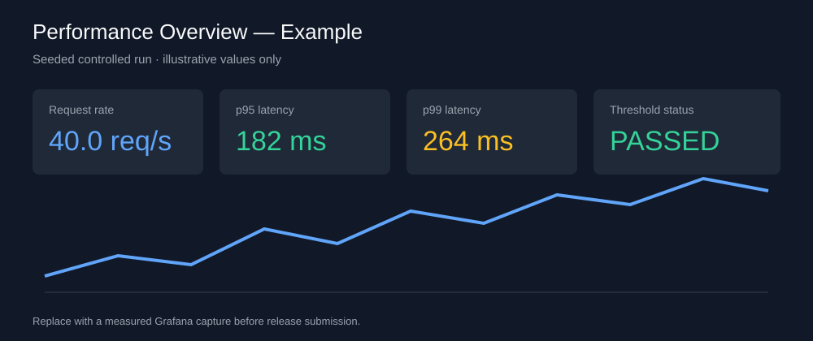
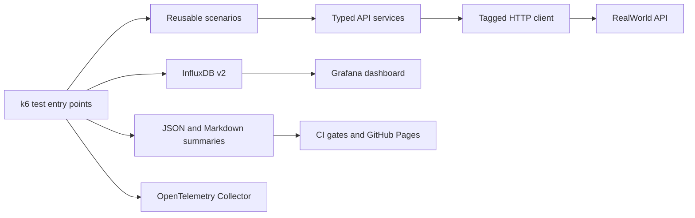

# k6 Performance Framework

[](https://github.com/qa-test-automation-frameworks/k6-performance-framework/actions/workflows/pr-smoke.yml)
[](https://github.com/qa-test-automation-frameworks/k6-performance-framework/actions/workflows/quality.yml)
[](https://github.com/qa-test-automation-frameworks/k6-performance-framework/actions/workflows/security.yml)
[](https://github.com/qa-test-automation-frameworks/k6-performance-framework/actions/workflows/main-load.yml)
[](https://qa-test-automation-frameworks.github.io/k6-performance-framework/)
[](https://github.com/qa-test-automation-frameworks/k6-performance-framework/releases/latest)
[](https://grafana.com/docs/k6/)
[](https://www.typescriptlang.org/)

Performance engineering as a governed system: typed k6 workloads, controlled targets,
SLO-based gates, reviewed regression baselines, Grafana/InfluxDB observability,
OpenTelemetry, and six distinct workload models for the RealWorld API.

## Reviewer Proof

| Evidence | Direct link |
| --- | --- |
| Live reports | [Published performance evidence](https://qa-test-automation-frameworks.github.io/k6-performance-framework/) |
| Current release | [v0.4.0](https://github.com/qa-test-automation-frameworks/k6-performance-framework/releases/tag/v0.4.0) |
| Primary CI | [Main load workflow](https://github.com/qa-test-automation-frameworks/k6-performance-framework/actions/workflows/main-load.yml) |
| Safety and quality | [Quality](https://github.com/qa-test-automation-frameworks/k6-performance-framework/actions/workflows/quality.yml) · [Security](https://github.com/qa-test-automation-frameworks/k6-performance-framework/actions/workflows/security.yml) |
| Repository activity | [Default-branch commits](https://github.com/qa-test-automation-frameworks/k6-performance-framework/commits/main/) · [Pull requests](https://github.com/qa-test-automation-frameworks/k6-performance-framework/pulls?q=is%3Apr) |
| Architecture and decisions | [Architecture](docs/architecture.md) · [ADR index](docs/adr/README.md) |
| Failure evidence | [Threshold failure example](docs/images/threshold-failure-example.svg) · [Interpretation guide](docs/results-interpretation.md) |
| Reviewed baseline report | [Human-openable load report](docs/reports/reviewed-load-report.md) |



## What This Framework Proves

| Engineering question | Implemented answer |
| --- | --- |
| How is unsafe load prevented? | Public targets are read-only; sustained and write-heavy workloads require a controlled target and explicit override. |
| How are regressions distinguished from noise? | Reviewed three-run baselines, p95/p99 comparisons, tolerance rules, and compatible-run selection. |
| How is performance made diagnosable? | Tagged metrics, JSON and Markdown summaries, Grafana/InfluxDB dashboards, and OpenTelemetry export. |
| How does the suite model different risks? | Smoke, load, stress, spike, soak, and breakpoint workloads with separate intent and thresholds. |
| How does CI remain credible? | Quality, security, main-load, reports, scheduled-soak, and release gates publish durable evidence. |

## Release Summary

Release `v0.4.0` establishes the review-ready performance platform: controlled
load targets, advanced workload gates, regression tooling, report publication,
observability capture, security scanning, and documented operational limits.
See [release notes](docs/releases/v0.4.0.md) and the [changelog](CHANGELOG.md).

## Architecture



Tests never call `k6/http` directly. Endpoint services own paths, payload envelopes, authentication,
and stable metric names. Write-heavy tests reject non-local targets unless explicitly overridden.

## Test Types

| Type       | Purpose                            | Default target        | Command                            |
| ---------- | ---------------------------------- | --------------------- | ---------------------------------- |
| Smoke      | Fast API and SLO validation        | Hosted API, read-only | `TARGET_ENV=staging npm run smoke` |
| Load       | Expected traffic and user journeys | Controlled local API  | `npm run load`                     |
| Stress     | Progressive degradation            | Controlled local API  | `npm run stress`                   |
| Spike      | Sudden traffic and recovery        | Controlled local API  | `npm run spike`                    |
| Soak       | Long-duration stability            | Controlled local API  | `npm run soak`                     |
| Breakpoint | Capacity boundary                  | Controlled local API  | `npm run breakpoint`               |

Use `npm run breakpoint:search` to run a binary-search capacity probe. Its JSON output reports
`lastHealthyVus`, `firstUnhealthyVus`, and `toleranceVus`.

## Controlled Load Service Objectives

### Scale and Scope

These objectives are controlled-target guardrails for a local RealWorld backend
running on a GitHub-hosted Ubuntu runner. They are not production service SLOs
and should not be compared to internet-facing latency targets. The reviewed
baseline currently represents a 20 RPS full load profile with 100 max VUs; see
the [human-openable load report](docs/reports/reviewed-load-report.md) for the
source workflow, target commit, framework commit, and measured percentiles.

| Endpoint group |       p95 |       p99 | Error rate |
| -------------- | --------: | --------: | ---------: |
| Authentication |  < 800 ms | < 1500 ms |       < 1% |
| Article reads  |   < 10 ms |   < 20 ms |       < 1% |
| Article writes | < 1000 ms | < 2000 ms |       < 2% |
| Comment reads  |    < 5 ms |   < 10 ms |       < 2% |
| Profiles       |    < 5 ms |   < 10 ms |       < 1% |
| Tags           |    < 5 ms |   < 10 ms |       < 1% |

See [performance SLOs](docs/performance-slos.md) for enforcement details.
The hosted read-only smoke test uses wider network-facing guardrails defined separately in
`config/thresholds/smoke.ts`.

## Quick Start

Prerequisites: Node.js 20+, npm 10.9.4, k6 2.0+, Docker Desktop, and Docker Compose.

```bash
npx --yes npm@10.9.4 ci
npm run typecheck
npm run lint
npm run test:unit
npm run build
```

Run the read-only validation profile:

```bash
TARGET_ENV=staging TEST_PROFILE=validation SUMMARY_NAME=smoke npm run smoke
```

```powershell
$env:TARGET_ENV = 'staging'
$env:TEST_PROFILE = 'validation'
$env:SUMMARY_NAME = 'smoke'
npm run smoke
```

Start observability and run a local observed load:

```bash
npm run docker:up
npm run docker:health
npm run load:observed
npm run observability:capture
```

Grafana is available at `http://localhost:3001` with local credentials `admin` / `admin`.
Grafana evidence is produced by local observed runs because GitHub-hosted CI does not persist a
remote InfluxDB. CI publishes JSON, Markdown, and Pages artifacts instead.

Authenticated scenarios create a disposable setup user against an authorized writable target:

```bash
export TARGET_ENV=local
export BASE_URL=http://localhost:3000/api
export TEST_PROFILE=validation
npm run load:journey
```

```powershell
$env:TARGET_ENV = 'local'
$env:BASE_URL = 'http://localhost:3000/api'
$env:TEST_PROFILE = 'validation'
npm run load:journey
```

Set `AUTH_USER_COUNT` to size the setup user pool. VUs select credentials deterministically from
that pool, avoiding a single-account bottleneck. Full non-local workloads also require explicit
`K6_STAGES`; built-in full profiles are limited to the controlled local target.

## CI and Evidence

- PR smoke posts an aggregate Markdown summary to same-repository pull requests.
- Main load, regression, and advanced workload workflows provision a pinned RealWorld backend.
- Load regression checks compare aggregate, endpoint, and business-metric p95/p99 values with a
  reviewed three-run baseline. Full advanced runs compare with their latest compatible retained run.
- Release publication waits for full stress, spike, soak, and breakpoint evidence.
- GitHub-hosted segmented validation proves partition wiring; the manual distributed workflow is
  reserved for authorized self-hosted runners and a shared controlled target.
- Security CI runs npm audit, creates a CycloneDX SBOM, and scans the lockfile with OSV.
- [Published performance reports](https://qa-test-automation-frameworks.github.io/k6-performance-framework/)

## Documentation

- [Architecture](docs/architecture.md)
- [Contributor onboarding](docs/onboarding.md)
- [Adapting to another API](docs/adapting-targets.md)
- [Engineering notes](docs/engineering-notes.md)
- [Results interpretation](docs/results-interpretation.md)
- [Performance SLOs](docs/performance-slos.md)
- [CI workflow map](docs/ci-map.md)
- [Cross-commit regression demonstration](docs/cross-commit-regression.md)
- [Visual performance evidence](docs/evidence.md)
- [Architecture decisions](docs/adr/README.md)
- [Capability status](docs/capability-status.md)
- [v0.4.0 release notes](docs/releases/v0.4.0.md)
- [v0.3.0 release notes](docs/releases/v0.3.0.md)
- [v0.2.0 release notes](docs/releases/v0.2.0.md)

## Safety

Public endpoints are restricted to short read-only checks. Authenticated writes and sustained load
default to a local target and require `ALLOW_NON_LOCAL_LOAD=true` elsewhere. Tokens, generated
runtime reports, and unreviewed baseline captures are excluded from version control. The local
observability stack ships with development credentials and anonymous Grafana viewer access; keep
those ports local or rotate credentials before exposing the stack.
