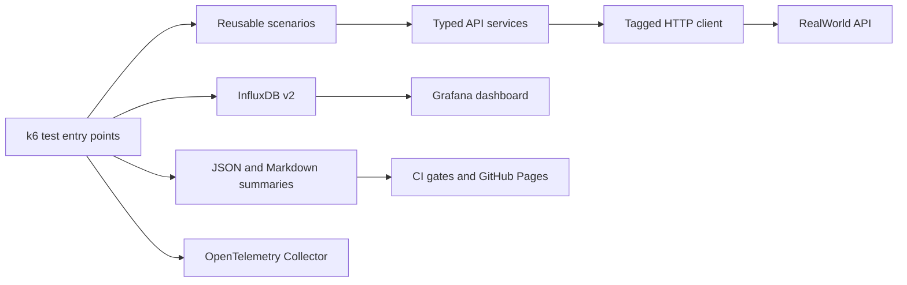

# k6 Performance Framework

[](https://github.com/qa-test-automation-frameworks/k6-performance-framework/actions/workflows/pr-smoke.yml)
[](https://github.com/qa-test-automation-frameworks/k6-performance-framework/actions/workflows/quality.yml)
[](https://github.com/qa-test-automation-frameworks/k6-performance-framework/actions/workflows/security.yml)
[](https://grafana.com/docs/k6/)
[](https://www.typescriptlang.org/)

Typed k6 performance automation for the RealWorld API, with controlled CI targets, SLO-based
thresholds, regression baselines, Grafana/InfluxDB observability, OpenTelemetry, and six workload
types.

## Architecture



Tests never call `k6/http` directly. Endpoint services own paths, payload envelopes, authentication,
and stable metric names. Write-heavy tests reject non-local targets unless explicitly overridden.

## Test Types

| Type       | Purpose                            | Default target        | Command                            |
| ---------- | ---------------------------------- | --------------------- | ---------------------------------- |
| Smoke      | Fast API and SLO validation        | Hosted API, read-only | `TARGET_ENV=staging npm run smoke` |
| Load       | Expected traffic and user journeys | Controlled local API  | `npm run load`                     |
| Stress     | Progressive degradation            | Controlled local API  | `npm run stress`                   |
| Spike      | Sudden traffic and recovery        | Controlled local API  | `npm run spike`                    |
| Soak       | Long-duration stability            | Controlled local API  | `npm run soak`                     |
| Breakpoint | Capacity boundary                  | Controlled local API  | `npm run breakpoint`               |

## Service Objectives

| Endpoint group |       p95 |       p99 | Error rate |
| -------------- | --------: | --------: | ---------: |
| Authentication |  < 800 ms | < 1500 ms |       < 1% |
| Article reads  |  < 500 ms | < 1000 ms |       < 1% |
| Article writes | < 1000 ms | < 2000 ms |       < 2% |
| Comments       |  < 750 ms | < 1500 ms |       < 2% |
| Profiles       |  < 500 ms | < 1000 ms |       < 1% |
| Tags           |  < 300 ms |  < 750 ms |       < 1% |

See [performance SLOs](docs/performance-slos.md) for enforcement details.

## Quick Start

Prerequisites: Node.js 20+, k6 2.0+, Docker Desktop, and Docker Compose.

```bash
npm ci
npm run typecheck
npm run lint
npm run test:unit
npm run build
```

Run the read-only validation profile:

```bash
TARGET_ENV=staging TEST_PROFILE=validation SUMMARY_NAME=smoke npm run smoke
```

```powershell
$env:TARGET_ENV = 'staging'
$env:TEST_PROFILE = 'validation'
$env:SUMMARY_NAME = 'smoke'
npm run smoke
```

Start observability and run a local observed load:

```bash
npm run docker:up
npm run docker:health
npm run load:observed
```

Grafana is available at `http://localhost:3001` with local credentials `admin` / `admin`.
Grafana evidence is produced by local observed runs because GitHub-hosted CI does not persist a
remote InfluxDB. CI publishes JSON, Markdown, and Pages artifacts instead.

Authenticated scenarios create a disposable setup user against an authorized writable target:

```bash
export TARGET_ENV=local
export BASE_URL=http://localhost:3000/api
export TEST_PROFILE=validation
npm run load:journey
```

```powershell
$env:TARGET_ENV = 'local'
$env:BASE_URL = 'http://localhost:3000/api'
$env:TEST_PROFILE = 'validation'
npm run load:journey
```

Set `AUTH_USER_COUNT` to size the setup user pool. VUs select credentials deterministically from
that pool, avoiding a single-account bottleneck. Full non-local workloads also require explicit
`K6_STAGES`; built-in full profiles are limited to the controlled local target.

## CI and Evidence

- PR smoke posts an aggregate Markdown summary to same-repository pull requests.
- Main load, regression, and advanced workload workflows provision a pinned RealWorld backend.
- Regression checks enforce absolute thresholds and require a reviewed seeded baseline for relative
  p95/p99 comparison.
- GitHub-hosted segmented validation proves partition wiring; the manual distributed workflow is
  reserved for authorized self-hosted runners and a shared controlled target.
- Security CI runs npm audit, creates a CycloneDX SBOM, and scans the lockfile with OSV.
- [Published performance reports](https://qa-test-automation-frameworks.github.io/k6-performance-framework/)

## Documentation

- [Architecture](docs/architecture.md)
- [Contributor onboarding](docs/onboarding.md)
- [Adapting to another API](docs/adapting-targets.md)
- [Engineering notes](docs/engineering-notes.md)
- [Results interpretation](docs/results-interpretation.md)
- [Visual performance evidence](docs/evidence.md)
- [Architecture decisions](docs/adr/README.md)
- [Capability status](docs/capability-status.md)
- [v0.4.0 release notes](docs/releases/v0.4.0.md)
- [v0.2.0 release notes](docs/releases/v0.2.0.md)

## Safety

Public endpoints are restricted to short read-only checks. Authenticated writes and sustained load
default to a local target and require `ALLOW_NON_LOCAL_LOAD=true` elsewhere. Tokens, generated
runtime reports, and unreviewed baseline captures are excluded from version control.
