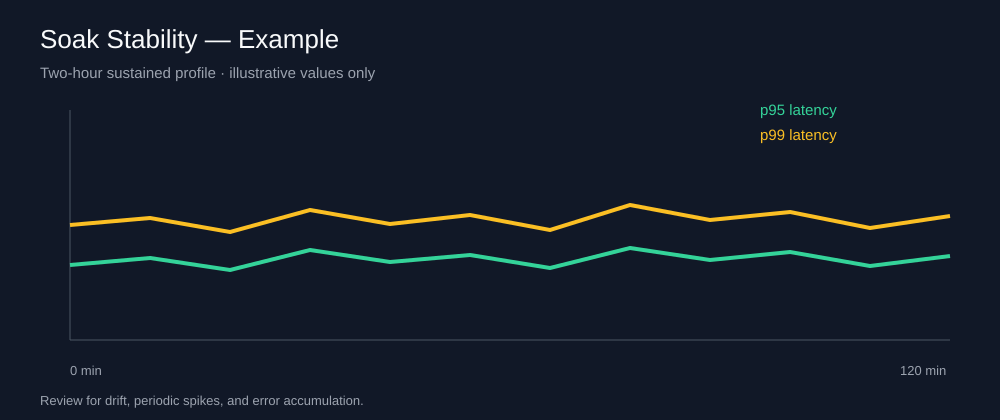
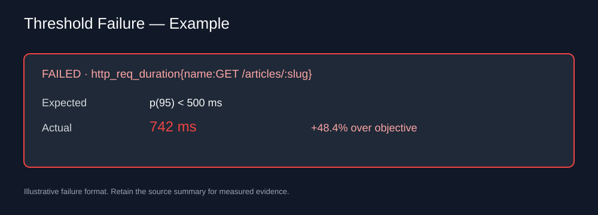

# Visual Performance Evidence

Measured evidence must come from a seeded controlled target. The example panels below document the
expected review format; they are intentionally labeled as examples and are not release evidence.

## Reviewed Baseline

The committed aggregate is retained for regression wiring, but it must be refreshed through the
controlled capture workflow before release because baseline compatibility now includes target,
profile, k6 version, and runner-class provenance.

## Overview

The release overview should identify the run, target commit, framework commit, workload profile,
request rate, p95/p99 latency, error rate, dropped iterations, and threshold status.

## Soak Stability

The soak review should show latency and error-rate stability across the complete sustained period,
not only the final aggregate.

## Failed Threshold

Failure evidence must show the metric, expected threshold, actual value, and breach magnitude.

## Capture Procedure

1. Start the controlled RealWorld target and seed at least five articles.
2. Run `npm run docker:up` and `npm run docker:health`.
3. Run `K6_RUN_ID=<commit-or-ticket> npm run load:observed`.
4. Run `npm run observability:capture` to export the overview and endpoint dashboards.
5. Select the matching `environment` and `run_id` in Grafana for any additional review.
6. Retain the PNG, JSON, and Markdown artifacts and link the matching Actions run.

Only replace the example assets with captures whose source summaries and baseline metadata are
retained. A release also requires completed full stress, spike, breakpoint, and soak workflow
evidence; short validation profiles prove wiring only.
